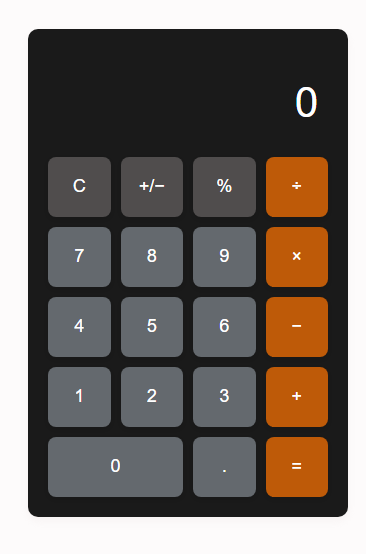

# 🧮 Calculadora

Uma calculadora funcional construída do zero com HTML, CSS e JavaScript puro.

## 📸 Preview

<!-- Adicione um print da sua calculadora aqui -->
 

## 🚀 Como usar

1. Clone o repositório:
   ```bash
   https://github.com/leotakahashii/calculadora
   ```
2. Abra o arquivo `index.html` no navegador — sem instalação necessária.

## ✨ Funcionalidades

- Operações básicas: adição, subtração, multiplicação e divisão
- Suporte a números decimais
- Inversão de sinal (+/−)
- Porcentagem (%)
- Proteção contra divisão por zero
- Encadeamento de operações (ex: `5 + 3 × 2`)
- Exibição da expressão em andamento no display

## 🛠️ Tecnologias

- **HTML5** — estrutura semântica
- **CSS3** — layout com Flexbox e CSS Grid, animações com `:active`
- **JavaScript** — manipulação de DOM, lógica de estado, event delegation

## 📁 Estrutura do projeto

```
calculadora/
├── index.html
├── style.css
└── script.js
```

## 💡 O que aprendi

- Gerenciamento de estado com variáveis (`currentValue`, `previousValue`, `operator`)
- Event delegation com um único `addEventListener` no container
- Uso de `parseFloat()` e `toString()` para converter entre tipos
- Grid CSS com `repeat(4, 1fr)` e `grid-column: span 2`
- Proteção contra entradas inválidas com `isNaN()`

## 🔜 Próximas melhorias

- [ ] Suporte a teclado com `keydown`
- [ ] Histórico de cálculos com `localStorage`
- [ ] Tema claro/escuro

---

Desenvolvido por [Leonardo Takahashi](https://github.com/leotakahashii)